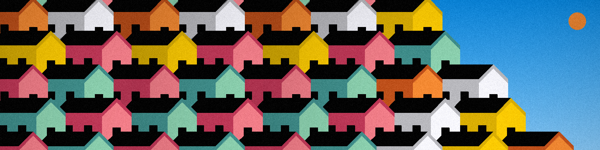

# Tarsila Houses

A C++17 and SDL2 application that renders colorful house scenes described in semicolon-delimited text files. The project implements its own lines, circles, Bézier curves, flood fills, and polygon fills to draw houses, the sun, and the background directly on an SDL surface.

Each house is assembled at runtime from geometric shapes. Its walls, roof, and door use the position, dimensions, angle, and colors defined in the scene file. Windows are added automatically and spaced according to the size of the walls, so changing a house's dimensions also changes its window layout without requiring individual window entries.

## Install and run on Windows

1. Download the ZIP from the [latest release](https://github.com/Bluzaborges/tarsila-houses/releases) and extract all its files into one folder.
2. Open PowerShell in the extracted folder and run:

```powershell
.\tarsila-houses.exe
```

The interactive shell displays a prompt. Type `help` to see the available commands, or enter `examples/houses.txt` to open the included scene. Closing the SDL window returns to the prompt so you can open another scene. Type `exit` to quit.

To open the example directly without entering the interactive shell, run:

```powershell
.\tarsila-houses.exe examples/houses.txt
```

## Requirements

- A C++17-compatible compiler
- CMake 3.21 or later
- Ninja
- SDL2

### Windows with MSYS2

Install the development tools from an MSYS2 UCRT64 terminal:

```bash
pacman -S --needed git mingw-w64-ucrt-x86_64-toolchain mingw-w64-ucrt-x86_64-cmake mingw-w64-ucrt-x86_64-ninja mingw-w64-ucrt-x86_64-SDL2
```

### Debian and Ubuntu

```bash
sudo apt update
sudo apt install git build-essential cmake ninja-build libsdl2-dev
```

## Build

From the repository root:

```bash
cmake --preset release
cmake --build --preset release
```

This creates an optimized executable for normal use. Development builds use the `debug` preset, as described in the editor sections below.

## Scene files

Scene files are plain text files organized by tags and fields separated by semicolons. The file extension does not define the format, but `.txt` is used to make its purpose clear.

```text
Screen;
Resolution;1024;768;
WorldSize;40;30;
Color;aliceblue;

House;
Position;5.85;28;
Height;5;
Width;8;
WallColor;pink;
RoofColor;black;
DoorColor;black;
```

Supported section tags are `Screen`, `House`, and `Sun`. See `examples/houses.txt` for a complete scene.

## Visual Studio Code

Install the Microsoft **C/C++** and **CMake Tools** extensions. On Windows, open the repository from an MSYS2 UCRT64 terminal so the editor uses the correct toolchain:

```bash
cd /c/path/to/tarsila-houses
code .
```

When Visual Studio Code is installed without its command-line entry in `PATH`, select **Add to PATH** in the installer or launch its `bin/code` script directly.

CMake Tools recognizes the project presets automatically. Before debugging, open the command palette and run **CMake: Select Configure Preset**, then select **Debug**.

After **Debug** is active:

1. Add a breakpoint.
2. Start **CMake: Debug** from the command palette.

The Output panel should show `build/debug` as the build directory. **CMake: Debug** starts the currently selected build; it does not automatically replace a Release build with a Debug build.

No `launch.json` is required. The example directory is copied beside the executable during the build, so `examples/houses.txt` works from both the terminal and the debugger.

Make sure the CMake Tools output references `C:\msys64\ucrt64` instead of `C:\mingw64`.

## Code::Blocks

On Windows, Code::Blocks can be installed in the same UCRT64 environment:

```bash
pacman -S --needed mingw-w64-ucrt-x86_64-codeblocks
```

Generate a Code::Blocks project from the repository root:

```bash
cmake -S . -B build/codeblocks -G "CodeBlocks - Ninja" -DCMAKE_BUILD_TYPE=Debug
```

CMake currently keeps this generator for compatibility but marks it as deprecated. The warning shown during generation does not prevent the project from being created. See the [CMake Code::Blocks generator documentation](https://cmake.org/cmake/help/latest/generator/CodeBlocks.html).

Open `build/codeblocks/tarsila-houses.cbp` in Code::Blocks and select the `tarsila-houses` target. Add a breakpoint by clicking next to a source line, then choose **Debug > Start / Continue**.

If Code::Blocks does not find the debugger automatically, open **Settings > Debugger**, select the default GDB configuration, and set the executable to:

```text
C:\msys64\ucrt64\bin\gdb.exe
```
## License

This project is licensed under the [MIT License](LICENSE).
